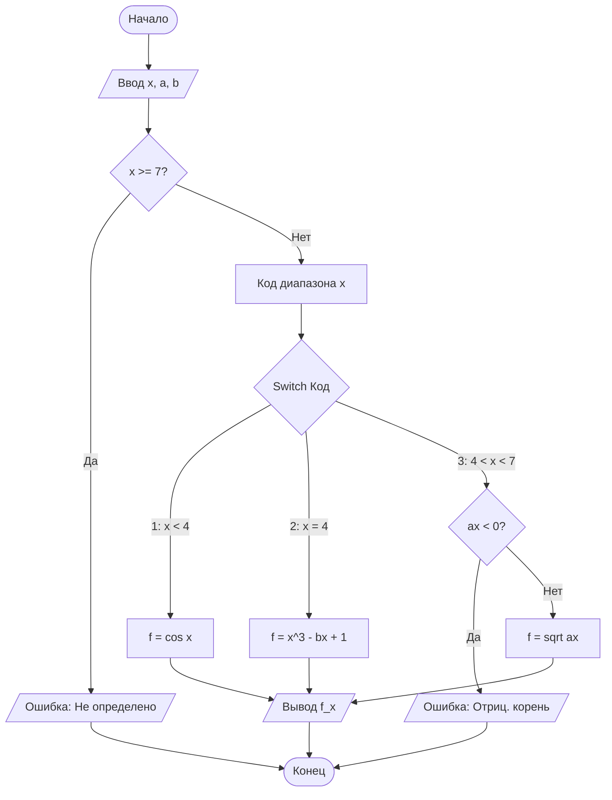
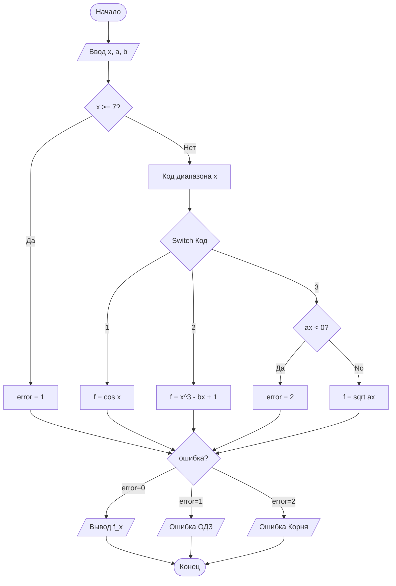

# Руководство (Walkthrough) — Кусочно-заданная функция (Вариант 16)

Этот документ содержит детали реализации и проверки кусочно-заданной функции $f(x)$ с использованием двух различных алгоритмов отчетности.

## Реализованные функции

- **Логика Варианта 16**: 
  - $x < 4 \implies \cos(x)$
  - $x = 4 \implies x^3 - bx + 1$
  - $4 < x < 7 \implies \sqrt{ax}$
- **Проверки ОДЗ**:
  - Общая проверка: $x < 7$
  - Проверка квадратного корня: $ax \geq 0$
- **Управление потоком**: Сопоставление диапазонов для оператора `switch`.
- **Стили отчетности**:
  - **Алгоритм 1**: Немедленное сообщение об ошибках.
  - **Алгоритм 2**: Отложенное сообщение об ошибках в конце программы.

## Блок-схемы логики

[Блок-схема](flowchart.mermaid)

````carousel

<!-- slide -->

````

## Результаты проверки

Был выполнен набор тестов, охватывающий все ветки логики и нарушения области определения.

| Случай | Ввод ($x, a, b$) | Ожидалось | Рез-т (Алг 1) | Рез-т (Алг 2) |
|---|---|---|---|---|
| 1 | `0, 1, 1` | `f(0) = 1.000` | ✅ Успех: 1.0000 | ✅ Успех: 1.0000 |
| 2 | `4, 1, 1` | `f(4) = 61.000` | ✅ Успех: 61.0000 | ✅ Успех: 61.0000 |
| 3 | `5, 1, 1` | `f(5) = 2.236` | ✅ Успех: 2.2361 | ✅ Успех: 2.2361 |
| 4 | `5, -1, 1` | Ошибка корня | ✅ Ошибка корня | ✅ ОШИБКА корня |
| 5 | `8, 1, 1` | Ошибка ОДЗ | ✅ Ошибка ОДЗ | ✅ ОШИБКА ОДЗ |

## Файлы
- [algorithm1.c](algorithm1.c) — Немедленная отчетность.
- [algorithm2.c](algorithm2.c) — Отложенная отчетность.
