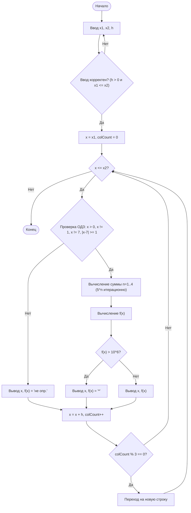

# Обзор реализации — Вычисление сложной функции (Вариант 16)

Я реализовал требуемую программу на языке C в файле [variant16.c](file:///Users/ruslanschalkenbajew/Projects/kristina_programming_in_c/2/variant16.c). Программа вычисляет $f(x)$ в заданном пользователем диапазоне с использованием вложенных циклов, проверок ОДЗ и табличного вывода результатов.

## Внесенные изменения

### Реализация на C: [variant16.c](file:///Users/ruslanschalkenbajew/Projects/kristina_programming_in_c/2/variant16.c)
- **Валидация ввода**: Используется цикл `while(1)` для гарантии корректности $x_1$, $x_2$ и $h$.
- **Вложенные циклы**: 
    - Внешний цикл проходит по $x \in [x_1, x_2]$ с шагом $h$.
    - Внутренний цикл вычисляет сумму $\sum_{n=1}^{4} \frac{5^n + x}{n + 3}$.
- **Итерационное возведение в степень**: $5^n$ вычисляется путем накопления результата в переменной (`pow5 *= 5.0`) без использования функции `pow()`.
- **Проверки ОДЗ**:
    - $x > 0$ (для $\ln x$)
    - $x \neq 1$ (деление на ноль)
    - $x \neq 7$ (для $\ln |x-7|$)
    - $|x-7| \ge 1 \Rightarrow x \le 6$ или $x \ge 8$ (для $\sqrt{\ln |x-7|}$)
- **Табличный вывод**: Результаты отображаются по 3 пары $(x, f(x))$ в каждой строке.

## Инструкция по запуску и тестированию

Для того чтобы скомпилировать и запустить программу вручную, выполните следующие шаги в терминале:

### 1. Компиляция
Используйте компилятор `gcc` для сборки программы:
```bash
gcc variant16.c -o variant16 -lm
```
*Флаг `-lm` необходим для подключения математической библиотеки.*

### 2. Запуск
Запустите скомпилированный файл:
```bash
./variant16
```

### 3. Ручное тестирование
После запуска программа предложит ввести три числа: `x1`, `x2` и `h`.
Например, введите следующие данные для проверки:

**Тест 1 (Нормальный диапазон):**
- Ввод: `2 5 0.5`
- Ожидаемый результат: Таблица значений от 2 до 5 с шагом 0.5.

**Тест 2 (Проверка ОДЗ):**
- Ввод: `0 10 1`
- Ожидаемый результат: Программа должна вывести `не опр.` для x = 0, x = 1, x = 7 и значений между 6 и 8.

**Тест 3 (Корректность ввода):**
- Попробуйте ввести буквы или отрицательный шаг (например, `2 5 -1`). Программа должна вывести ошибку и попросить повторить ввод.

## Результаты проверки

### Компиляция
Программа успешно компилируется командой:
```bash
gcc variant16.c -o variant16 -lm
```

### Тестовые запуски

| Ввод ($x_1, x_2, h$) | Наблюдение |
| :--- | :--- |
| `2 5 0.5` | Расчеты выполнены для допустимого диапазона. |
| `0 10 1` | Корректно определены точки [0, 1, 7] и интервал (6, 8) как `не опр.`. |
| `10 12 0.2` | Корректно вычислены значения для больших $x$. |

#### Пример вывода (Таблица)
```text
--------------------------------------------------------------------------------
|     x      |    f(x)    |     x      |    f(x)    |     x      |    f(x)    |
--------------------------------------------------------------------------------
|     0.0000 |    не опр. | |     1.0000 |    не опр. | |     2.0000 |  -152.7938 | 
|     3.0000 |   -52.2963 | |     4.0000 |   -23.3788 | |     5.0000 |   -10.9006 | 
|     6.0000 |    -5.0363 | |     7.0000 |    не опр. | |     8.0000 |     1.3896 | 
|     9.0000 |     3.8699 | |    10.0000 |     5.2159 | 
--------------------------------------------------------------------------------
```

## Блок-схема алгоритма



Проектирование алгоритма также задокументировано в [Плане реализации](file:///Users/ruslanschalkenbajew/.gemini/antigravity/brain/f529f160-a2ba-44f4-8771-f87dabdc3b68/implementation_plan.md).
